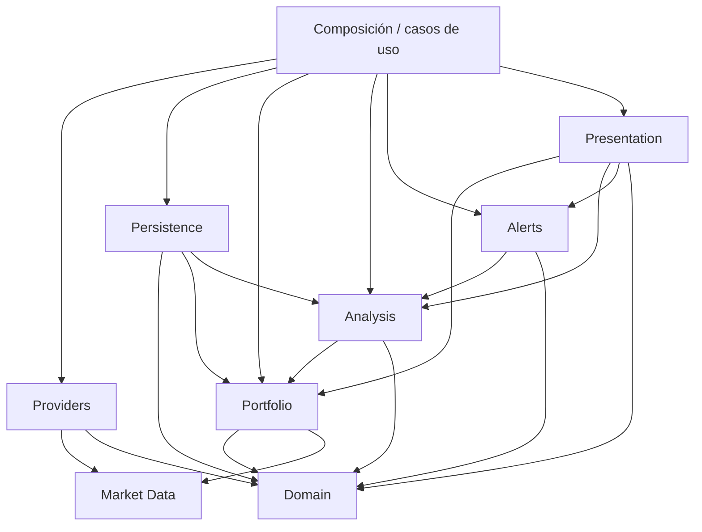

# Arquitectura de OpenPortfolio

## Propósito y principios

OpenPortfolio será una prueba de concepto local y *open source* para observar una cartera de inversión a largo plazo. Su función es informativa: calcula métricas, detecta condiciones configuradas y genera alertas, pero no recomienda compras o ventas, no cursa órdenes y no se conecta a brokers.

Las decisiones concretas de este documento constituyen el **baseline v0.1**. Son el punto de partida acordado y podrán ajustarse de forma explícita y versionada a partir de la evidencia obtenida durante la PoC.

La arquitectura se guía por estos principios:

- el dominio y las reglas no dependen de proveedores, interfaces de usuario ni canales de entrega;
- los datos externos entran a través de interfaces propias y sustituibles;
- los resultados deterministas deben poder reproducirse con las mismas entradas y configuración;
- la presentación y las explicaciones no cambian los cálculos ni deciden si se genera una alerta;
- los secretos y datos privados permanecen fuera del repositorio;
- la primera versión favorece componentes sencillos, tipados y comprobables antes que infraestructura distribuida.

## Capas y responsabilidades

### Domain

Contiene el vocabulario común, los modelos de dominio, identificadores, tipos de valor y validaciones invariantes. Incluye conceptos como `Instrument`, `Transaction`, `MarketQuote`, `AnalysisEvent` y `Alert`, definidos conceptualmente en [data-model.md](data-model.md).

No conoce yfinance, ntfy, Streamlit, formatos de archivos ni mecanismos de ejecución. Tampoco contiene reglas específicas de presentación o transporte.

### Portfolio

Reconstruye y representa la cartera a partir de posiciones o transacciones. Sus responsabilidades son:

- mantener posiciones por instrumento y cartera;
- calcular cantidad, coste medio y valor de mercado;
- calcular pesos sobre el valor total;
- calcular exposición por dimensiones disponibles, por ejemplo instrumento, tipo de activo, sector, región, moneda o narrativa;
- producir `PortfolioSnapshot` con una fecha de valoración y procedencia trazable.

Depende de modelos y tipos de `Domain`. Recibe cotizaciones ya normalizadas; no obtiene precios directamente ni conoce al proveedor que los suministró.

El baseline usa EUR como moneda base. Conserva la unidad y moneda originales de cada activo y transacción, y convierte a EUR únicamente para la vista consolidada. El coste medio analítico es ponderado: las compras incorporan sus comisiones al coste acumulado; las ventas reducen unidades al coste medio vigente sin alterar el coste unitario restante; dividendos, recompensas e ingresos de efectivo no lo reducen; y los *splits* u otras operaciones corporativas ajustan cantidad y coste unitario sin cambiar el coste total. Se conserva precisión decimal y solo se redondea en presentación. Este cálculo no sustituye al cálculo fiscal, que puede requerir FIFO y otras reglas.

### Market Data

Define el contrato interno para solicitar precios y tipos de cambio y normaliza la respuesta como `MarketQuote`. También define cómo representar ausencia de datos, datos obsoletos, moneda, instante de mercado y errores recuperables.

Esta capa actúa como frontera estable entre el núcleo y los proveedores externos. Puede aplicar políticas de selección o caché en una evolución futura, pero no debe incluir reglas de cartera ni análisis.

Para el coste histórico se usa el tipo de cambio de la transacción de Revolut cuando esté disponible. Para la valoración actual se usa un FX vigente obtenido mediante una interfaz reemplazable. Cada conversión conserva el tipo, la fuente y la fecha utilizados. Nunca se recalcula retrospectivamente el coste de adquisición con el cambio actual; si falta el FX histórico, la transacción queda incompleta.

### Providers

Contiene adaptadores para servicios externos. La primera implementación prevista usará yfinance y será responsable de:

- traducir el identificador interno de un instrumento al símbolo del proveedor;
- invocar al proveedor;
- convertir sus respuestas al contrato de `Market Data`;
- traducir errores, valores ausentes y metadatos de procedencia a resultados internos conocidos.

Ninguna otra capa importará ni utilizará directamente la API de yfinance. Los adaptadores no calculan pesos, detectan eventos ni generan mensajes.

### Analysis

Evalúa reglas deterministas sobre un `PortfolioSnapshot`, cotizaciones y configuración explícita. En la prueba de concepto contempla:

- desviaciones frente a pesos objetivo, cuando estos existan;
- concentración por instrumento o por una agrupación soportada;
- eventos relevantes definidos mediante umbrales verificables, por ejemplo variaciones de precio o cotizaciones obsoletas.

Cada coincidencia produce un `AnalysisEvent` estructurado con regla, severidad, valores observados, umbral, instante y evidencia. La capa no formula recomendaciones de inversión y no entrega notificaciones.

El baseline define tres severidades: `INFO` para cambios relevantes sin revisión inmediata, `REVIEW` cuando se cruza un umbral que merece análisis humano y `HIGH` para riesgo elevado, incoherencias graves o datos que impiden confiar en el resultado. Los valores iniciales, almacenados en YAML y nunca codificados rígidamente, son:

| Condición | Severidad inicial |
|---|---|
| Caída del 20 % desde el precio de compra o máximo relevante configurado | `REVIEW` |
| Caída del 25 % o más desde esa referencia | `HIGH` y revisión estructurada |
| Posición individual próxima o superior al 10 % de la cartera invertida | `REVIEW` |
| ETF fuera del rango estratégico del 70–80 % | `REVIEW` |
| Acciones individuales fuera del rango estratégico del 20–30 % | `REVIEW` |
| Oro fuera del rango orientativo del 5–10 % | `REVIEW` |
| Bitcoin por encima del 3 %; entre el 1–3 % está dentro de rango | `HIGH` por encima del umbral |
| Sector fuera de su rango objetivo configurado | `REVIEW` |
| Fallo aislado del proveedor | `INFO` |
| Fallos consecutivos que impiden valorar la cartera | `HIGH` |

Estos eventos activan una revisión y no una orden ni un rebalanceo inmediato. La política de frescura distingue mercado cerrado de dato obsoleto: durante un día de mercado, una cotización con más de 24 horas es `stale` y genera `REVIEW`; más de 72 horas sin explicación por fin de semana o festivo genera `HIGH`; y un FX con más de 24 horas en una ejecución ordinaria es `stale`. Toda observación conserva timestamp, proveedor y estado de frescura.

### Alerts

Transforma uno o varios `AnalysisEvent` en un `Alert` apto para un canal. Sus responsabilidades incluyen deduplicación, agrupación, prioridad, estado de entrega y renderizado de un contenido informativo.

Para evitar fatiga, el diseño futuro prevé que una condición abierta no se notifique en cada ejecución. Solo se reenviará si aumenta la severidad, cambia materialmente el valor según una tolerancia configurada o vence el periodo de recordatorio. Una condición resuelta podrá reabrirse si vuelve a cruzar el umbral. La vertical mínima actual no tiene persistencia ni deduplicación: ntfy recibe únicamente alertas `REVIEW` o `HIGH`; `INFO` no se envía.

El envío por ntfy está detrás de una interfaz de entrega. El servidor y el topic se obtienen en tiempo de ejecución mediante variables de entorno o GitHub Actions Secrets; el topic se trata como secreto y nunca forma parte del dominio, la configuración versionada ni los registros.

### Presentation

Será un futuro dashboard Streamlit de solo lectura. Consultará casos de uso para mostrar posiciones, pesos, exposición, frescura de precios y eventos. No accederá directamente a yfinance, no duplicará cálculos y no mutará la cartera mediante operaciones de trading.

La presentación puede adaptar formatos, filtros y textos, pero la cifra canónica y la decisión de disparar una regla proceden de `Portfolio` y `Analysis`.

### Persistence

Define puertos para cargar configuración y guardar o recuperar estado cuando resulte necesario. En el baseline, YAML validado mediante esquema se reserva para configuración mantenida por personas: cartera declarativa, instrumentos, asignaciones objetivo, umbrales, reglas de alertas y parámetros del IOS. Se usará solo un subconjunto sencillo de YAML. JSON se reserva para eventos, resultados generados e intercambio de datos entre módulos. Una evolución posterior podrá usar una base de datos implementando los mismos contratos.

Los detalles del formato pertenecen a adaptadores de persistencia. La configuración versionable contendrá solo datos ficticios o plantillas sin secretos. La persistencia de históricos, migraciones y concurrencia queda fuera de la primera versión.

## Dependencias permitidas

Las flechas indican que el módulo de origen puede depender del módulo de destino. `Domain` no depende de ninguna otra capa.

Reglas adicionales:

- `Domain` no importa infraestructura.
- `Portfolio` y `Analysis` consumen contratos, no adaptadores concretos.
- `Providers` implementa contratos de `Market Data`; no es una dependencia del núcleo.
- `Presentation` y los canales de `Alerts` son extremos de entrada o salida y no son reutilizados por el dominio.
- el módulo de composición elige implementaciones y coordina los casos de uso; no contiene reglas de negocio.
- una base de datos, yfinance, ntfy o Streamlit pueden reemplazarse sin cambiar las reglas deterministas.

## Flujo desde el precio hasta la alerta

1. El ejecutor carga y valida mediante esquema la configuración YAML de una cartera ficticia y las reglas activas.
2. Un caso de uso solicita a la interfaz de `Market Data` las cotizaciones y tipos de cambio necesarios.
3. Los adaptadores obtienen los datos y los normalizan como `MarketQuote`, conservando proveedor, instante, moneda y frescura.
4. `Portfolio` combina posiciones, cotizaciones y FX compatibles para crear un `PortfolioSnapshot` consolidado en EUR. Si falta un precio o cambio, o está obsoleto, lo refleja explícitamente; no lo sustituye silenciosamente.
5. `Analysis` ejecuta reglas deterministas y genera cero o más `AnalysisEvent` con evidencia estructurada.
6. La vertical mínima de `Alerts` filtra severidades y genera un `Alert` informativo; las políticas de deduplicación y agrupación quedan pendientes.
7. En local, la salida puede mostrarse por consola; un adaptador reemplazable puede entregar mediante ntfy únicamente `REVIEW` y `HIGH`.
8. El resultado de la ejecución indica de forma observable si hubo éxito, datos incompletos o un fallo técnico; un fallo de proveedor no se presenta como señal financiera.

## Sustitución de yfinance

El contrato de `Market Data` estará definido por las necesidades de OpenPortfolio, no por la forma de la API de yfinance. Las cotizaciones se normalizarán a modelos internos y los símbolos específicos se mantendrán en el adaptador o en metadatos de instrumento claramente delimitados.

Para añadir otro proveedor se implementará un nuevo adaptador y se seleccionará en el punto de composición. Las pruebas del núcleo usarán dobles deterministas del contrato; un conjunto común de pruebas de conformidad verificará que cada adaptador respeta moneda, marcas temporales, procedencia, valores ausentes y semántica de errores. Este diseño evita que objetos, excepciones o convenciones de yfinance se propaguen al resto de la aplicación.

## Reglas deterministas e IA

Las reglas que producen `AnalysisEvent` son deterministas, versionables y auditables. Sus entradas, umbrales, versión y evidencia quedan registrados para poder repetir el resultado. Una explicación generada por IA, si se incorpora en el futuro, será una transformación opcional y posterior de eventos ya calculados.

La IA:

- no calcula el valor canónico de la cartera;
- no modifica severidades ni decide si una regla se cumple;
- no produce recomendaciones automáticas de compra o venta;
- no recibe datos personales ni secretos;
- debe etiquetarse como texto generado y permitir siempre mostrar la evidencia determinista original;
- no bloquea la creación o entrega de una alerta si no está disponible.

## Límites de la prueba de concepto

La PoC se limita inicialmente a una cartera ficticia, configuración YAML sencilla, resultados JSON, precios de fin de periodo o últimos precios disponibles, conversión trazable a EUR, métricas básicas y reglas configurables. Se priorizarán ejecución reproducible y pruebas sobre cobertura exhaustiva de mercados.

Quedan fuera de alcance:

- conexión con brokers, custodia y ejecución de operaciones;
- recomendaciones personalizadas o asesoramiento financiero;
- sincronización automática con Revolut u otras entidades;
- cálculo fiscal, lotes FIFO, comisiones complejas y casuística avanzada de operaciones corporativas o divisas;
- datos intradía en tiempo real, garantías de disponibilidad o calidad comercial;
- multiusuario, autenticación, permisos y despliegue de producción;
- base de datos e históricos duraderos en las primeras fases;
- decisiones basadas exclusivamente en modelos de IA.

## Privacidad y seguridad

- El repositorio solo incluirá ejemplos ficticios y nunca extractos reales, credenciales, tokens ni datos personales. Los datos generados o filas originales de importación permanecerán fuera del repositorio público.
- El topic secreto de ntfy y los secretos de futuros servicios se inyectarán mediante variables de entorno en local y GitHub Actions Secrets en automatización.
- Los errores y registros evitarán volcar configuración completa, topics, URLs de publicación o documentos importados.
- La importación manual futura aplicará minimización de datos, validación antes de uso y una ruta local explícita; el archivo original no se versionará.
- Las dependencias externas quedarán confinadas a adaptadores y se fijarán y revisarán cuando se incorporen.
- Las alertas serán informativas, mostrarán la antigüedad y procedencia de los datos cuando sea relevante y no incluirán acciones ejecutables de trading.
- Se aplica mínimo privilegio a GitHub Actions y el topic de ntfy nunca se registra.

## Ejecución local y GitHub Actions

La misma aplicación y los mismos casos de uso se ejecutarán en ambos entornos; solo cambiarán el disparador, la configuración y los adaptadores de salida.

En local, una invocación manual cargará un archivo YAML ficticio, consultará precios y FX y presentará el informe, las alertas o un resultado JSON. La hora se mostrará en `Europe/Madrid`, aunque los instantes canónicos se conserven en UTC. Los tests usarán proveedores simulados y datos fijos para no depender de red, hora o disponibilidad de yfinance.

En GitHub Actions, la vertical actual solo admite ejecución manual mediante `workflow_dispatch`. El horario diario previsto por el baseline queda pendiente y no se añade todavía. Un resumen semanal podrá añadirse después y el resumen ordinario se consultará bajo demanda.

El workflow tiene únicamente `contents: read`, timeout limitado y control de concurrencia. No puede hacer commits, crear releases o pull requests ni modificar el repositorio. El servidor y el topic de ntfy se resuelven desde GitHub Actions Secrets, con `https://ntfy.sh` como servidor predeterminado, y no aparecen en logs.

Los fallos temporales del proveedor admitirán en una fase posterior hasta tres intentos con espera progresiva. Los errores de configuración, validación o credenciales no se reintentarán. Si se agotan los intentos, se generará una sola alerta técnica. El workflow manual mínimo ya existe; su primera activación con un topic real requiere revisión humana.

## Investment Operating System

En la fase 6, el Investment Operating System (IOS) será una capa versionada de políticas, contexto y apoyo a decisiones humanas, no una IA que recomienda operaciones. Representará objetivos y rangos de asignación; concentración por activo, sector, región, divisa y narrativa; checklists mensuales, trimestrales y anuales; tesis con estado `SOLID`, `WATCH`, `DETERIORATING` o `BROKEN`; decisiones y excepciones; revisiones activadas por precio, peso o calidad de datos; y el historial de cambios del propio IOS.

Su incorporación seguirá este orden: políticas y reglas deterministas; registro de tesis y decisiones; checklists y revisiones; y, por último, explicaciones opcionales asistidas por IA. Hechos, reglas y comentarios generados se distinguirán de forma explícita. Ningún componente podrá modificar automáticamente el IOS y este seguirá siendo comprensible y utilizable si se elimina toda IA.
